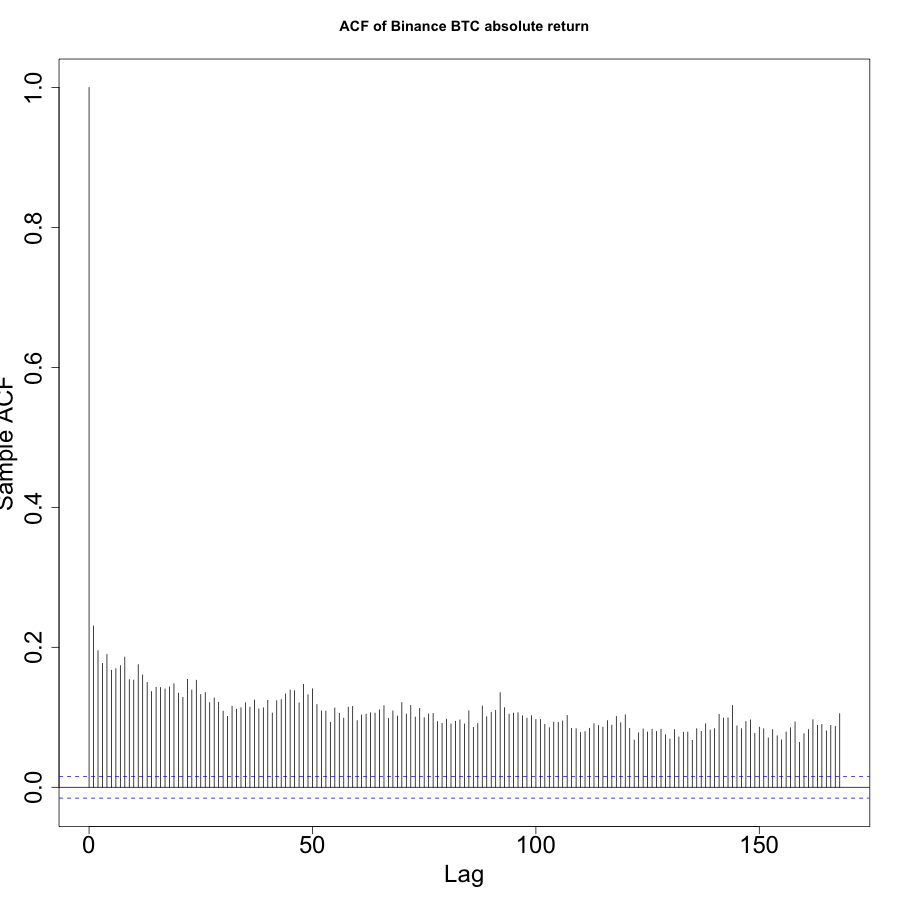

[](http://quantlet.de/)

## [](http://quantlet.de/) **network_CC_exchanges** [](http://quantlet.de/)

```yaml

Name of QuantLet: network_CC_exchanges

Description: Which exchange counts in crypto market? A high-frequency dynamic network perspective

Keywords: network analysis, high-frequency, crpyto, HAR

Author: Yifu Wang

Submitted: Wed, June 8 2022 by Yifu Wang

```



